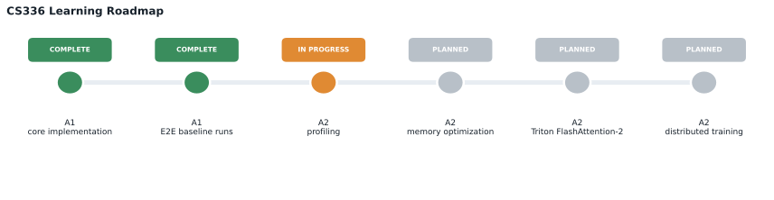
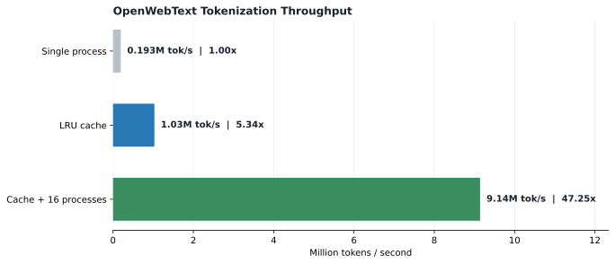
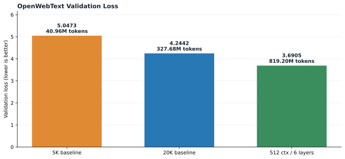

# CS336 Learn

从零实现语言模型，并继续深入单 GPU 性能分析、Triton GPU Kernel 与分布式训练。

This repository records my implementation-driven study of Stanford CS336: Language Modeling from Scratch. Assignment 1 covers the complete language-modeling pipeline; Assignment 2 extends it into profiling, memory optimization, FlashAttention-2, DDP, optimizer sharding, and FSDP.



## Current Progress / 当前进度

| Area | Status | Current result |
| --- | --- | --- |
| Assignment 1 core implementation | Complete | Tokenizer, Transformer LM, AdamW, data loading, checkpointing, training and generation |
| TinyStories end-to-end pipeline | Complete | Validation loss `1.8751`; coherent story-style generation |
| OpenWebText tokenizer and preprocessing | Complete | 32K BPE on 12 GB text; 2.7B train tokens serialized |
| OpenWebText LM experiments | Complete baseline | Best recorded validation loss `3.6905` on RTX 5090 |
| Assignment 2 systems | In progress | Building the synchronized end-to-end benchmarking harness |

The active task is CS336 Spring 2026 Assignment 2, Section 2.1.3: implementing configurable forward, backward, and optimizer-step benchmarks with warm-up and correct CUDA synchronization.

## Assignment 1 / Language Modeling Basics

Implemented from scratch:

- Byte-level BPE training and tokenizer encoding/decoding
- `Linear`, `Embedding`, RMSNorm, SwiGLU and RoPE
- Causal multi-head self-attention and Transformer blocks
- Numerically stable softmax and cross-entropy
- AdamW, cosine learning-rate schedule and gradient clipping
- Memory-mapped token loading and random batch sampling
- Checkpoint save/load, training/evaluation loops and text generation
- JSONL experiment logging and reproducible loss/LR plots

### Tokenizer Engineering

The original Python encoder was too slow for 12 GB OpenWebText. Pretoken-level LRU caching, precomputed byte tokens and 16-process sharded encoding increased benchmark throughput from `0.193M` to `9.14M tokens/s`.



Measured preprocessing results:

| Task | Result |
| --- | ---: |
| Train 32K BPE on 12 GB OpenWebText | about 36.5 min |
| Tokenize 2.727B train tokens | 167.15 s |
| Full train-split throughput | about 16.31M tokens/s |
| Sample benchmark speedup | 47.25x |

### Language Model Experiments



| Dataset / Run | Model | Tokens seen | Device | Validation loss |
| --- | --- | ---: | --- | ---: |
| TinyStories 5K | 4L, `d=512`, context 256 | 40.96M | Apple Silicon MPS | 1.8751 |
| OWT 5K baseline | 45.2M params, context 256 | 40.96M | RTX 5090 | 5.0473 |
| OWT 20K baseline | 45.2M params, context 256 | 327.68M | RTX 5090 | 4.2442 |
| OWT 512-context run | 91.6M params, 6 layers | 819.20M | RTX 5090 | **3.6905** |

Additional measured observations:

- Single-batch overfit reduced loss from `9.2346` to `0.0002` in 300 steps.
- BF16 autocast improved the same 512-context model from about `67K` to `113K tokens/s`, approximately `1.69x`.
- The strongest OWT run used about `22.5 GB` of a 32 GB RTX 5090 and reached about `99%` GPU utilization.

Detailed records live in [OWT_EXPERIMENTS.md](OWT_EXPERIMENTS.md), [TRAINING_EXPERIMENTS.md](TRAINING_EXPERIMENTS.md), and [PROJECT_OPTIMIZATION_NOTES.md](PROJECT_OPTIMIZATION_NOTES.md).

## Assignment 2 / Systems

The Spring 2026 starter is under [`assignment2-systems/`](assignment2-systems/). The learning route follows the official handout:

1. End-to-end benchmarking and Nsight Systems profiling
2. Mixed precision and CUDA memory profiling
3. Activation checkpointing
4. Triton FlashAttention-2
5. Distributed data parallel training
6. Optimizer state sharding
7. Fully sharded data parallel training

Current implementation:

- Imported and configured the Spring 2026 starter.
- Recorded the ordered learning plan and CUDA-vs-macOS development boundary.
- Added the model-size table, CLI configuration scaffold, and random GPU batch generation for the first benchmark task.
- Next: three benchmark modes, warm-up, CUDA synchronization, mean and standard deviation.

## Repository Layout

```text
CS336-learn/
├── assignment1-basics/       # Tokenizer, Transformer, training and generation
├── assignment2-systems/      # Profiling, kernels and distributed systems
├── docs/readme/              # Reproducible README data and figures
├── OWT_EXPERIMENTS.md        # OpenWebText experiment history
├── TRAINING_EXPERIMENTS.md   # Training configurations and results
└── PROJECT_OPTIMIZATION_NOTES.md
```

## Validation

Assignment 1:

```bash
cd assignment1-basics
uv run pytest -q
```

Assignment 2 environment:

```bash
cd assignment2-systems
uv run python -c "import cs336_basics, cs336_systems"
```

Regenerate README figures:

```bash
cd CS336-learn
uv run --project assignment2-systems python docs/readme/generate_readme_assets.py
```

Large datasets, token arrays, checkpoints and generated training outputs are intentionally excluded from Git.
